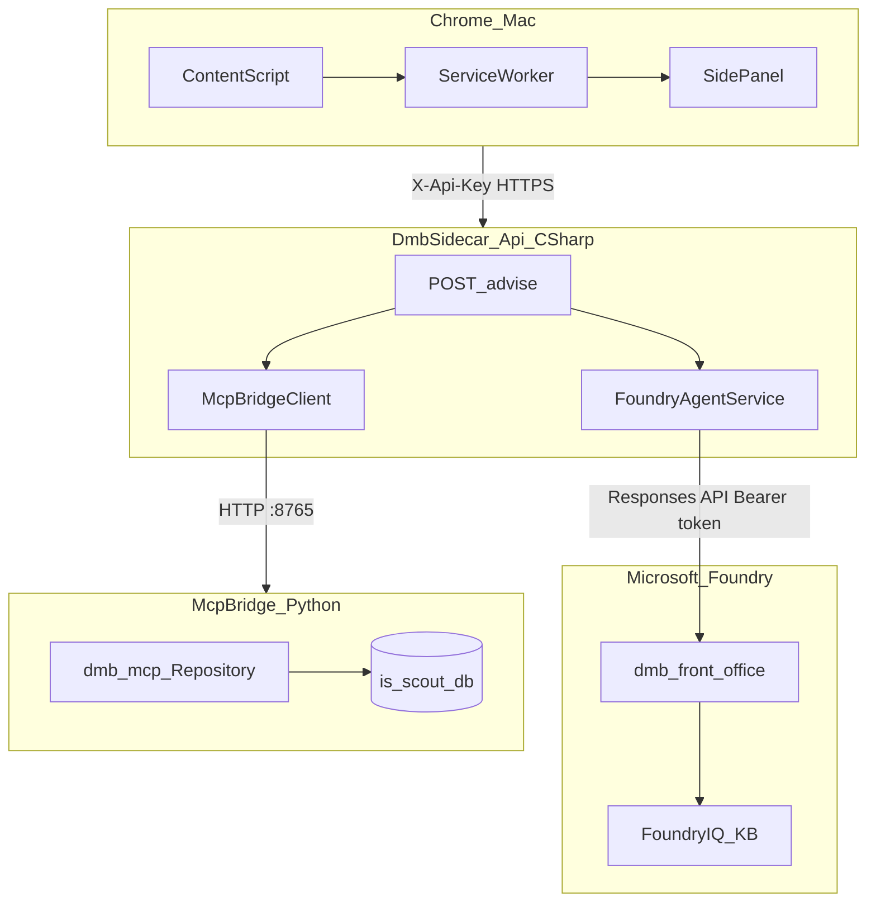

# DMB Sidecar — Architecture

## System context



## Component responsibilities

| Component | Technology | Responsibility |
|-----------|------------|----------------|
| Content script | TypeScript | URL → PageAdapter → structured JSON |
| Service worker | TypeScript | Message broker; `fetch` to API |
| Side panel | HTML/TS | UX; display citations |
| DmbSidecar.Api | ASP.NET Core 8 | Auth, orchestration, Foundry HttpClient |
| DmbSidecar.McpBridge | FastAPI | League data HTTP surface over dmb_mcp |
| Foundry agent | Azure portal | Model + instructions + IQ |
| iq-sources/ | Markdown | Corpus uploaded to Foundry IQ |

## Security boundaries

```
┌─────────────────────────────────────────┐
│  TRUSTED (user machine)                 │
│  Chrome extension — API key only        │
└─────────────────┬───────────────────────┘
                  │ localhost
┌─────────────────▼───────────────────────┐
│  API — Azure credentials via            │
│  DefaultAzureCredential                 │
│  IS session cookie — env file only      │
└─────────────────┬───────────────────────┘
                  │
         Foundry / SQLite
```

## Key design decisions

- [ADR-001](docs/decisions/ADR-001-stack-split.md) — TypeScript + C# + Python
- [ADR-002](docs/decisions/ADR-002-foundry-http-vs-agent-framework.md) — Responses API not .NET 10 Agent Framework
- [ADR-003](docs/decisions/ADR-003-mcp-bridge-import-vs-stdio.md) — HTTP bridge imports dmb_mcp

## Hackathon alignment

| Requirement | How met |
|-------------|---------|
| Microsoft Foundry | Agent + Responses API |
| IQ layer | Foundry IQ knowledge base |
| MCP / tools | dmb-mcp-server data via bridge |
| Multi-step reasoning | Prompt assembly: page → MCP → IQ-grounded agent |
| Demoable | Chrome side panel on live IS |
